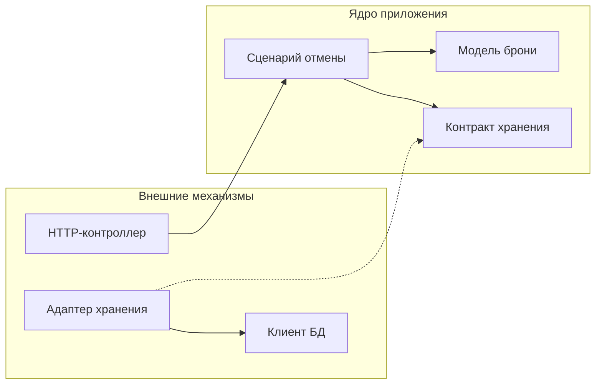

# Explicit Architecture: границы и взаимодействие компонентов

Этот раздел помогает читать схему Explicit Architecture: различать обязанности её частей и понимать, как через них проходит действие пользователя. Это самостоятельный учебный разбор с вымышленными сценариями, а не scaffold или перечень обязательных компонентов.

Автор схемы — Herberto Graça. В [исходной статье](https://herbertograca.com/2017/11/16/explicit-architecture-01-ddd-hexagonal-onion-clean-cqrs-how-i-put-it-all-together/) он объединяет идеи DDD, портов и адаптеров, Onion, Clean Architecture и CQRS. [Оригинал в Google Drawings](https://docs.google.com/drawings/d/18zMDp_JOVZZ6qcGndsz1z_xAk85eGPt3sZR3X5VRE0E/edit) можно открыть отдельно и увеличить.


Изображение загружается из публичного оригинала. Ниже различаются обозначения схемы, варианты из авторской статьи и наш учебный пример. Транзакции, проверка версии, обработка повторов и Outbox в примере — практические дополнения: сама схема не задаёт эти решения.

## Как читать области схемы

Начните с центра, затем рассмотрите левую и правую стороны. В центре находится поведение приложения. Слева — способы запустить это поведение. Справа — механизмы, к которым приложение обращается для выполнения задачи.

| Обозначение | Смысл |
| --- | --- |
| Application Core | Ядро приложения: прикладной и доменный уровни вместе |
| Domain Model, Aggregate / Entities | Предметные объекты, их состояние и правила допустимого изменения |
| Domain Services | Предметные операции, которым нет естественного места в отдельной сущности или значении |
| Application Layer | Прикладные сценарии: доступ, последовательность действий и координация зависимостей |
| Primary / Driving Adapters | Входящие адаптеры: контроллеры, CLI-команды и другие способы вызвать сценарий |
| Secondary / Driven Adapters | Исходящие адаптеры: хранение, поиск, отправка сообщений и уведомлений |
| Ports | Контракты на границе ядра, через которые оно принимает вызовы или использует внешние возможности |
| Component | Предметная часть приложения, которая может включать несколько уровней |

Слои и компоненты показывают разные разрезы системы. Слой объединяет код по роли, компонент — по предметной ответственности. Число окружностей и сторон многоугольника не задаёт число каталогов, сервисов или процессов.

## Зависимость кода и вызов при выполнении

Направленная внутрь зависимость означает, что внешний код знает внутренний контракт, а внутренний код не знает конкретную внешнюю реализацию. Это ограничение импортов, типов и обращений к именованным компонентам. Во время выполнения вызов может идти из сценария к адаптеру через этот контракт. Такое различие описано в [The Clean Architecture](https://blog.cleancoder.com/uncle-bob/2012/08/13/the-clean-architecture.html).

Ниже — фрагмент зависимостей для учебного сценария отмены брони. Сплошная стрелка означает использование типа, пунктирная — реализацию интерфейса.



При выполнении сценарий вызывает метод переданного объекта хранения, и исполняется код адаптера. Знания класса адаптера для этого не требуется: сценарий работает с контрактом. Поэтому вызов наружу совместим с зависимостью исходного кода внутрь.

Сборка приложения выбирает адаптер и передаёт его сценарию, например через конструктор. Там же подключаются настройки и выбирается время жизни зависимостей. Контейнер может автоматизировать эту сборку; самостоятельное обращение модели к глобальному контейнеру скрывало бы её реальные зависимости.

## Что именно делает порт

Порт описывает разговор с ядром на языке его потребностей. Входящий адаптер обращается к входному контракту; исходящий реализует контракт возможности, нужной ядру. Различие определяется тем, кто инициирует взаимодействие. Основание — [Hexagonal Architecture](https://alistair.cockburn.us/hexagonal-architecture).

В учебном примере входной контракт — операция `CancelBooking` с идентификаторами брони и действующего лица, результатом и определёнными отказами. Её можно выразить публичным методом сценария; отдельный интерфейс для каждого сценария не обязателен.

Выходной контракт хранения, например `BookingStore`, определяет, как загрузить бронь и сохранить отмену. Существенны и условия: что означает отсутствие, как обнаруживается конфликт версии, каким исходом представлена недоступность хранилища. Набор сигнатур без этих договорённостей ещё не описывает всё поведение границы.

Адаптер переводит этот контракт в запросы к БД и обратно. Он восстанавливает модель из записи, сопоставляет ошибки и не выдаёт сетевой или SQL-сбой за отсутствие брони. Контроллер переводит результат сценария в HTTP-ответ. Таким образом, формат записи и формат ответа остаются обязанностями соответствующих адаптеров.

## Репозиторий, ORM и адаптер БД

Справа на рисунке показана цепочка `Persistence → ORM Adapter → ORM → MySQL/SQLite Adapter → БД`. В [разделе Flow of control авторской статьи](https://herbertograca.com/2017/11/16/explicit-architecture-01-ddd-hexagonal-onion-clean-cqrs-how-i-put-it-all-together/#flow-of-control) отдельно рассматривается интерфейс репозитория: он скрывает способ получения данных, а интерфейс Persistence — используемый ORM.

Для разбора полезно разделять три обязанности:

| Граница | Что она отделяет |
| --- | --- |
| Контракт репозитория | Потребность загрузить и сохранить предметный объект от устройства запросов и хранения |
| Persistence и ORM Adapter | Потребителя операций хранения от API конкретного ORM |
| Адаптер или драйвер БД | ORM или SQL-клиент от протокола и особенностей конкретной СУБД |

Последняя часть часто уже предоставляется библиотекой. Наличие блока на схеме не означает, что проекту нужен собственный класс с таким названием.

В нашем примере возможен путь выполнения `BookingStore → DatabaseBookingStore → ORM или SQL-клиент → драйвер → БД`. Контракт `BookingStore` принадлежит ядру, а конкретный способ запросов и преобразования записей — адаптеру. Если эта граница уже скрывает ORM от ядра, дополнительный интерфейс над ORM требует самостоятельной задачи: например, нескольких реализаций хранения, которым нужен общий ограниченный контракт. Дублировать API библиотеки ради ещё одного слоя не требуется.

При замене ORM меняется код, работающий с его API. При замене СУБД могут измениться запросы, отображение типов и гарантии записи, даже если ORM остаётся прежним. Сохранность контракта нужно проверить: стрелки на схеме не обещают бесплатной замены технологии.

## Сценарий, прикладной сервис и доменный сервис

Сценарий — прикладная задача, например отмена брони. Прикладной сервис и обработчик команды — способы организовать её выполнение. `CancelBookingHandler` может сам реализовать сценарий; отдельный `CancelBookingService` между ним и моделью не является обязательной ступенью.

Распределим обязанности на собственном примере:

| Участник | Его решение или действие |
| --- | --- |
| Модель `Booking` | Допустимо ли отменить бронь в её текущем состоянии и в переданный момент |
| Прикладной сценарий отмены | Кто действует, какую бронь загрузить, когда получить время, вызвать модель и сохранить результат |
| Доменный сервис `RefundPolicy` в контексте расчётов | Какую сумму можно вернуть по правилам тарифа, условиям отмены и уже проведённому платежу, если у этого расчёта нет естественного владельца среди предметных объектов |

Для возврата прикладной сценарий контекста расчётов получает необходимые данные, передаёт их политике, применяет её решение и организует сохранение и обращение к платёжной системе. `RefundPolicy` в этом варианте вычисляет предметный результат по переданным значениям. HTTP, загрузка записей и отправка платежа остаются за пределами этого расчёта. Проверка допустимости отмены остаётся у `Booking`: отдельный доменный сервис нужен предметной операции, у которой нет естественного места в сущности или объекте-значении. Это критерий паттерна Service в [DDD Reference Эрика Эванса](https://www.domainlanguage.com/wp-content/uploads/2016/05/DDD_Reference_2015-03.pdf).

Обработчик может делегировать прикладному сервису, если подключает шину к уже существующему сценарию или отделяет требования библиотеки шины от его входного контракта. Если HTTP и CLI уже могут вызвать один и тот же обработчик, дополнительная цепочка делегирования сама по себе ничего не добавляет.

В [варианте автора](https://herbertograca.com/2017/11/16/explicit-architecture-01-ddd-hexagonal-onion-clean-cqrs-how-i-put-it-all-together/#domain-services) доменный сервис не знает репозиториев, размещённых в Application Layer. Причина — направление зависимости между слоями. Из этого не следует универсальный запрет на доменный контракт репозитория в других вариантах DDD; размещение контрактов должно соответствовать выбранным обязанностям и направлению зависимостей.

## Проход сценария записи

Возьмём намерение: «Отменить мою бронь». Для примера считаем, что владелец может отменить подтверждённую бронь строго до начала услуги. Повтор отмены уже отменённой брони успешен и не меняет состояние. Время решения определяется после загрузки брони.

1. **Входящий адаптер** проверяет форму запроса, устанавливает действующее лицо из доверенного источника и вызывает сценарий отмены.
2. **Прикладной сценарий** открывает необходимую границу согласованной записи и получает через порт бронь вместе со сведениями для защиты сохранения.
3. **Сценарий** проверяет владельца, получает текущий момент из зависимости времени и передаёт его модели.
4. **Модель брони** проверяет состояние и время. Она либо изменяет состояние, либо сообщает о повторе без изменения, либо отклоняет переход.
5. **Сценарий и адаптер хранения** сохраняют изменение с защитой от конкуренции. В варианте с версией запись обновляется только при совпадении ожидаемой версии; иначе возникает конфликт.
6. **После успешной фиксации** результат возвращается входящему адаптеру. Тот формирует ответ своего протокола.

Если другой процесс изменил бронь после загрузки, успешная проверка модели в памяти не даёт права перезаписать новое состояние. Конфликт требует повторной оценки актуальной модели или явного отказа. Если состояние уже отменено, в условиях этого примера повтор не требует новой записи.

У CLI-команды изменится подготовка входа и вывод результата. Правила владельца, времени и сохранения будут исполняться тем же сценарием и моделью.

## Проход сценария чтения

Теперь намерение другое: «Показать мои ближайшие брони». Для ответа нужны идентификатор, время начала и состояние.

```text
Входящий адаптер
    → сценарий чтения с действующим лицом и фильтрами
    → контракт получения списка
    → адаптер запроса
    → проекция результата
    → ответ входящего адаптера
```

Сценарий определяет доступную пользователю область данных. Адаптер выбирает нужные поля и возвращает согласованное представление. Для такого списка можно обойтись без восстановления агрегатов: предметного перехода здесь нет. Если ответ требует бизнес-вычисления, у его правила всё равно должен оставаться явный владелец.

DTO результата передаёт согласованные данные, например время начала и состояние брони. ViewModel, если она нужна интерфейсу, определяет их отображение: подпись состояния, формат даты, доступные элементы управления. Решение сервера о допустимости отмены по-прежнему принимается при выполнении сценария записи; состояние кнопки его не заменяет.

Свежесть списка и право изменить бронь — отдельные договорённости. Например, вчерашняя проекция может показывать подтверждённую бронь, уже отменённую сегодня. Сценарий записи принимает решение по актуальному состоянию и учитывает конкуренцию.

Разные модели чтения и изменения — отдельный архитектурный выбор. Для CQRS не обязательны разные базы или процессы; наличие методов чтения и записи само по себе ещё не объясняет необходимость такого разделения. Его пользу оценивают по различию задач этих моделей и цене их согласования. См. [CQRS](https://martinfowler.com/bliki/CQRS.html).

## Шины, обработчики и очередь

Схема показывает несколько механизмов обмена сообщениями. У них разные обязанности:

| Механизм | Работа |
| --- | --- |
| Шина команд и запросов | Находит обработчик переданного намерения или запроса данных |
| Шина событий | Передаёт произошедший факт подписанным обработчикам |
| Очередь сообщений | Обеспечивает передачу и отложенную обработку сообщений согласно настройкам выбранного транспорта |

Например, команда `CancelBooking` просит выполнить отмену, запрос `ListBookings` просит данные, а событие `BookingCancelled` сообщает о свершившемся факте. Для команды обычно выбирается один целевой обработчик; на событие могут реагировать несколько подписчиков.

Шина команд может работать обычным вызовом внутри процесса: диспетчер находит обработчик по типу сообщения и передаёт его дальше. Соответствие сообщений обработчикам задаётся при сборке приложения. Прямой вызов того же сценария также сохраняет архитектурные границы.

Очередь добавляет другую границу: выполнение может перейти в иной процесс и произойти позже. Отправитель использует исходящий адаптер, а получатель сообщения запускает сценарий через входящий адаптер. Один брокер может участвовать в обеих ролях.

### Событие и реакция на него

На схеме есть Event Listeners, а в статье различаются доменные и прикладные события. В нашем примере доменное событие `BookingCancelled` обозначает факт предметной модели; прикладное событие может сообщать об исходе целого сценария. Если эти смыслы совпадают, отдельные классы для обоих уровней не обязательны.

Прикладной слушатель в контексте расчётов связывает факт отмены со своим сценарием возврата. Адаптер потребителя очереди отвечает за получение и разбор сообщения, а сценарий возврата — за прикладную обработку. Расчёт суммы при этом остаётся предметным правилом. Такая цепочка помогает отделить доставку, реакцию приложения и бизнес-решение.

### Практическое дополнение: фиксация и доставка события

Продолжим учебный пример: после отмены требуется уведомить владельца. Появление доменного события в памяти ещё не означает успешной фиксации изменения. Отказ сохранения не должен приводить к уведомлению об успешной отмене. При этом отправка только после commit оставляет возможный разрыв: состояние уже сохранено, а процесс завершился до передачи сообщения.

Если потеря сообщения недопустима, один из вариантов — сохранить намерение доставки в той же транзакции, что и отмену, а отправку поручить отдельному процессу. Такой механизм называется [Transactional Outbox](https://microservices.io/patterns/data/transactional-outbox.html). Повторная отправка возможна, поэтому получатель должен учитывать дубликаты. Сама стрелка к шине или очереди этой гарантии не создаёт.

Доменный факт и внешнее сообщение могут иметь разные представления. Например, для доставки уведомления понадобятся идентификатор события и версия контракта. Их формат и правила повторной обработки согласуются на границе обмена.

## Компонент и граница предметной модели

В учебном приложении бронирование отвечает за допустимость отмены, а расчёты — за платежи и возвраты. Каждая такая предметная часть может содержать собственные сценарии, модель и адаптеры. Поэтому компонент пересекает уровни схемы.

Граница контекста определяется согласованным смыслом терминов, владельцами правил и контрактами взаимодействия. Один контекст может содержать несколько агрегатов и сценариев. Название каталога или выделение отдельного процесса само по себе эту границу не устанавливает.

Если отмена должна повлечь возврат, требуется описать связь: какие сведения получает контекст расчётов, кто определяет сумму, что происходит при отказе и повторе. Связь может использовать публичную операцию или согласованное событие. В обоих случаях остаётся зависимость от смысла и версии контракта; посредник или шина её не устраняют.

### Вызов другого компонента и Shared Kernel

В [разделе Decoupling the components](https://herbertograca.com/2017/11/16/explicit-architecture-01-ddd-hexagonal-onion-clean-cqrs-how-i-put-it-all-together/#decoupling-the-components) автор рассматривает строгий вариант: компоненты не ссылаются даже на интерфейсы друг друга. Среди средств такого разделения — события, общий Shared Kernel и обнаружение сервисов. Это конкретный выбор устройства взаимодействия.

В нашем примере прямая публичная операция возврата создаёт явную зависимость вызывающего компонента от контракта расчётов. Событие отмены позволяет бронированию не знать перечень получателей, но получателям всё равно нужен согласованный смысл события. Если его класс находится внутри компонента бронирования, импорт этого класса сохраняет зависимость от его кода. Перенос в общую библиотеку меняет владельца зависимости, а требования совместимости остаются. Обнаружение сервисов решает, куда отправить запрос; смысл запроса оно не согласует.

Shared Kernel — небольшая совместно поддерживаемая часть предметной модели и связанного кода, с согласованными изменениями и проверкой совместимости. Так он описан в [DDD Reference](https://www.domainlanguage.com/wp-content/uploads/2016/05/DDD_Reference_2015-03.pdf). Его цена — необходимость координации участников при развитии общей части.

Для бронирования и расчётов общий тип события оправдан, если обе стороны принимают его значение, состав и порядок изменения. Альтернатива — опубликованный контракт сообщения и перевод в собственные типы получателя. Папка `Shared` со всеми DTO, сущностями и утилитами не создаёт Shared Kernel сама по себе; общность технического формата ещё не означает общность предметной модели.

### Как получать данные другого компонента

Автор допускает чтение чужих данных из общего хранилища при записи только своих, а для разделённых хранилищ описывает локальные копии, обновляемые событиями. Эти варианты приведены в [Getting data from other components](https://herbertograca.com/2017/11/16/explicit-architecture-01-ddd-hexagonal-onion-clean-cqrs-how-i-put-it-all-together/#getting-data-from-other-components).

Применительно к нашему примеру выбор выглядит так:

| Способ | Как расчёты получают сведения об отмене | Цена границы |
| --- | --- | --- |
| Публичный запрос к бронированию | Вызывают операцию с согласованным ответом | Зависят от контракта; при удалённом вызове — также от доступности и задержки |
| Чтение из общей БД | Выполняют разрешённый запрос к данным бронирования | Зависят от схемы и смысла данных; изменения требуют согласования |
| Локальная проекция | Хранят нужные сведения у себя и обновляют их по сообщениям владельца | Получают данные с задержкой и поддерживают доставку и восстановление проекции |

Одна физическая БД совместима с владением данными по компонентам. Однако даже чтение чужой таблицы связывает потребителя с её устройством. Для независимого развития компонентов предпочтителен публичный контракт, скрывающий внутреннюю схему хранения. Если выбран доступ через БД, нужно явно согласовать доступные данные и изменение их формата, например через представление или опубликованную схему чтения. Возврат не должен напрямую переводить чужую бронь в другое состояние: изменение проходит через её владельца и его правила.

Локальная копия не становится вторым источником истины о брони. Расчёты обновляют её по сведениям бронирования, сохраняя собственное владение платежами и возвратами. В нашем варианте обработки событий потребитель различает повтор и более старое изменение, а проекцию можно восстановить из данных владельца или доступной истории сообщений. Если правило требует строгого согласования состояний двух компонентов, одной асинхронной проекции недостаточно: нужен отдельно определённый протокол взаимодействия. Сам по себе дополнительный запрос актуальных данных также не делает изменения в двух компонентах атомарными.

## Как выбирать глубину реализации

Приоритет — понятные обязанности, явные границы и защита предметных правил. Полезность разделения оценивается по тому, помогает ли оно понимать, изменять и проверять поведение. Порт с единственным адаптером может быть оправдан изоляцией значимой зависимости.

Чем масштабнее и сложнее проект, больше участников, дольше сопровождение и выше цена ошибки, тем весомее основания вкладываться в чистые архитектурные подходы. При сомнительной выгоде упрощения предпочтение остаётся за сохранением границ.

Дополнительные механизмы выбираются под конкретные потребности. Шина может централизовать диспетчеризацию; очередь — перенести обработку; отдельная модель чтения — упростить выдачу данных. Польза каждого решения должна оправдывать его настройку, диагностику и сопровождение. Изображение всех этих механизмов на одной схеме не требует вводить их одновременно.

Выбранные границы проверяются разными способами: предметное поведение — изолированными примерами, сценарии — через их входы и подменяемые порты, адаптеры — на реальных контрактах внешних механизмов. Показанные на рисунке MySQL и SQLite иллюстрируют варианты подключения. Подмена БД в тестах не доказывает одинаковую семантику транзакций и конкуренции: эти свойства проверяются на целевой СУБД.
