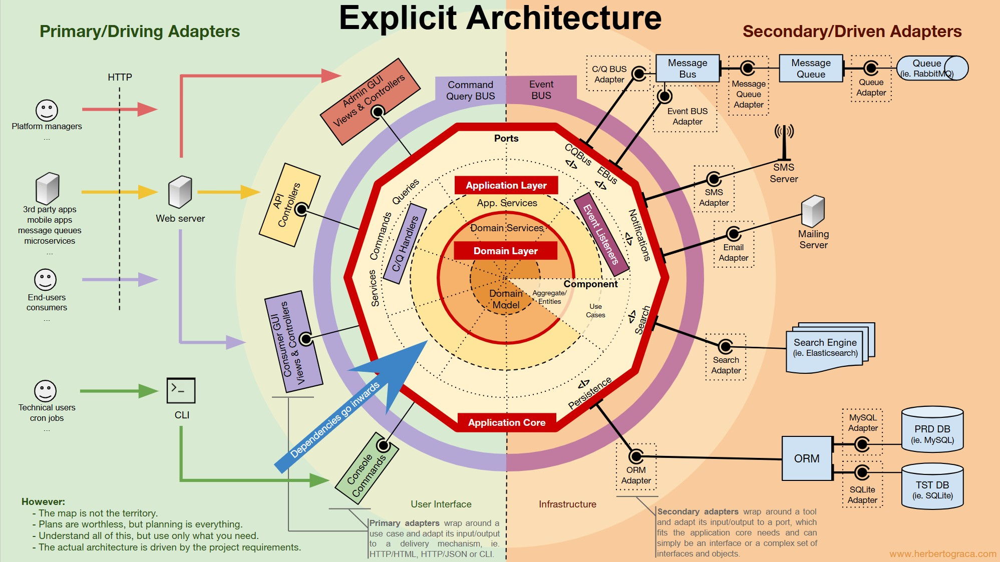
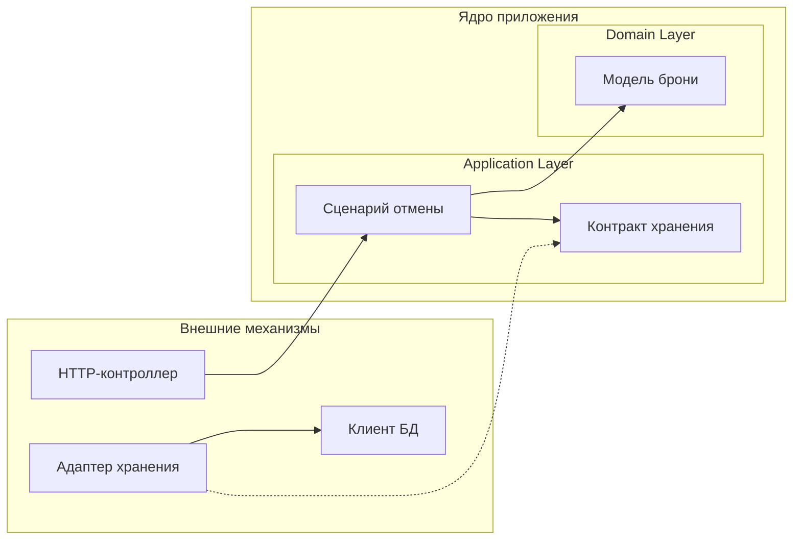

# Explicit Architecture: границы и взаимодействие компонентов

Этот раздел объясняет, как отделять предметные правила от технических механизмов, распределять обязанности между уровнями и сохранять границы компонентов. Это самостоятельный методический материал с вымышленными сценариями, а не scaffold или готовый шаблон проекта. Выбор решений зависит от задачи, требуемых гарантий и условий сопровождения.

В основе материала — [Explicit Architecture Herberto Graça](https://herbertograca.com/2017/11/16/explicit-architecture-01-ddd-hexagonal-onion-clean-cqrs-how-i-put-it-all-together/) и работы о DDD, портах и адаптерах, Onion, Clean Architecture и CQRS. Иллюстрация — Herberto Graça; [оригинал в Google Drawings](https://docs.google.com/drawings/d/18zMDp_JOVZZ6qcGndsz1z_xAk85eGPt3sZR3X5VRE0E/edit).

<p align="center">
  <a href="assets/hex-arch.jpg">
    
  </a>
</p>

Нажмите на изображение, чтобы открыть его в полном размере.

## Архитектурные основания

Архитектурные подходы решают связанные задачи. Их совместное применение помогает связать предметную модель, прикладные сценарии и техническую реализацию:

| Подход | На какой вопрос отвечает | Практическое следствие |
| --- | --- | --- |
| [Hexagonal / Ports & Adapters](https://alistair.cockburn.us/hexagonal-architecture) | Как отделить поведение приложения от способов его запуска и внешних механизмов | Приложение взаимодействует с окружением через собственные контракты и подключаемые адаптеры |
| [DDD](https://www.domainlanguage.com/wp-content/uploads/2016/05/DDD_Reference_2015-03.pdf) | Как выразить предметный смысл, правила и границы модели | Термины, инварианты и владельцы решений определяют устройство модели и взаимодействие контекстов |
| [Onion](https://jeffreypalermo.com/2008/07/the-onion-architecture-part-1/) | Как организовать зависимости вокруг предметной модели | Доменные типы и контракты не зависят от конкретных реализаций инфраструктуры |
| [Clean Architecture](https://blog.cleancoder.com/uncle-bob/2012/08/13/the-clean-architecture.html) | Как защитить правила и сценарии от деталей реализации | Зависимости направлены к внутренним правилам; адаптеры преобразуют внешние форматы в формы, нужные ядру |
| [CQRS](https://martinfowler.com/bliki/CQRS.html) | Когда нужны разные модели для изменения и чтения данных | Модели можно развивать под разные задачи, явно определив способ их согласования |

Для гексагональной архитектуры основная граница проходит между приложением и его окружением. Внутреннее устройство ядра выбирается отдельно: сама граница не предписывает агрегаты, доменные сервисы или CQRS. В нашем примере можно сохранить один процесс, одну БД и прямой вызов сценария, при этом явно отделив вход, предметное поведение и хранение. Более подробная организация ядра оправдывается сложностью его правил и развития.

## Обязанности частей приложения

Ядро приложения выполняет прикладные сценарии и защищает предметные правила. Входящие адаптеры запускают его операции, исходящие предоставляют необходимые внешние возможности.

| Часть приложения | Обязанность |
| --- | --- |
| Application Core | Ядро приложения: прикладной и доменный уровни вместе |
| Domain Model, Aggregate / Entities | Предметные объекты, их состояние и правила допустимого изменения |
| Domain Services | Предметные операции, которым нет естественного места в отдельной сущности или значении |
| Application Layer | Прикладные сценарии: доступ, последовательность действий и координация зависимостей |
| Primary / Driving Adapters | Входящие адаптеры: контроллеры, CLI-команды и другие способы вызвать сценарий |
| Secondary / Driven Adapters | Исходящие адаптеры: хранение, поиск, отправка сообщений и уведомлений |
| Ports | Контракты на границе ядра, через которые оно принимает вызовы или использует внешние возможности |
| Component | Предметная часть приложения, которая может включать несколько уровней |

Слои и компоненты задают разные разрезы системы. Слой объединяет код по роли, компонент — по предметной ответственности. Структура каталогов и размещение процессов должны поддерживать выбранные границы и обязанности.

## Границы и их отношения

Граница ядра, направление зависимостей между уровнями и границы компонентов действуют одновременно. Каждая ограничивает свой вид связности:

| Граница | Ограничение |
| --- | --- |
| Ядро и окружение | Контракты взаимодействия определяются потребностями ядра. Контроллеры и технические адаптеры подключаются к ним и могут выполняться в том же процессе |
| Прикладной и доменный уровни | Сценарии координируют использование модели; модель и доменные сервисы не зависят от прикладной координации |
| Предметные компоненты | Каждый компонент сохраняет владение своими правилами и внутренней моделью. Доступ к другому компоненту определяется публичным контрактом |

Порт принадлежит ядру: входящие адаптеры используют его контракт, исходящие реализуют нужную ядру возможность. У внешних инструментов есть собственные технические интерфейсы, например между ORM и драйвером БД. При работе через них адаптер учитывает требования библиотеки и сохраняет контракт приложения.

### Ядро и его уровни

`Application Core` включает `Application Layer` и `Domain Layer`. Доменный уровень содержит модель и доменные сервисы. Прикладной уровень координирует работу с доменом; предметные объекты сохраняют собственные правила независимо от того, какой сценарий их использует.

Например, сценарий отмены может обратиться прямо к `Booking`. Доменный сервис выделяется, когда у предметной операции нет естественного владельца среди сущностей и объектов-значений. Количество участников вызова определяется их обязанностями; границы уровней ограничивают допустимые зависимости между ними.

### Как компоненты пересекают уровни

Предметный компонент может включать собственные сценарии, модель и адаптеры. Разделение по обязанностям и по предметной принадлежности можно выразить на примере бронирования и расчётов:

| Уровень | Бронирование | Расчёты |
| --- | --- | --- |
| Прикладной, внутри ядра | Сценарий отмены брони | Сценарий возврата |
| Доменный, внутри ядра | `Booking` и правила отмены | Модель платежа и `RefundPolicy` |
| Адаптеры, за пределами ядра | Контроллер отмены и реализация `BookingStore` | Адаптер хранения платежей и клиент платёжной системы |

Принадлежность уровню отвечает на вопрос об обязанности кода, принадлежность компоненту — о владельце предметного решения. Эти ограничения действуют одновременно. Прикладной код расчётов, напрямую изменяющий внутреннюю модель `Booking`, может соблюдать направление «к домену» и при этом нарушать границу компонента бронирования. Переход между компонентами требует согласованного публичного контракта, в том числе когда оба входят в ядро одного приложения.

Реализация `BookingStore` принадлежит компоненту бронирования и остаётся внешней по отношению к его ядру. Сценарий этого же компонента использует контракт хранения; общая предметная принадлежность не оправдывает зависимость от SQL-клиента или конкретного адаптера.

Границы контекста, агрегата, транзакции и процесса определяются отдельно. Контекст задаёт область согласованной предметной модели; агрегат объединяет объекты, целостность которых защищается совместно. Транзакция определяет атомарно фиксируемые изменения, процесс — среду исполнения кода. Один компонент может включать несколько агрегатов, несколько компонентов — работать в одном процессе и использовать общую БД. Гарантии согласованности и размещение исполнения выбираются с учётом этих различий.

## Зависимость кода и вызов при выполнении

Направленная внутрь зависимость означает, что внешний код знает внутренний контракт, а внутренний код не знает конкретную внешнюю реализацию. Это ограничение импортов, типов и обращений к именованным компонентам. Во время выполнения вызов может идти из сценария к адаптеру через этот контракт. Такое различие описано в [The Clean Architecture](https://blog.cleancoder.com/uncle-bob/2012/08/13/the-clean-architecture.html).

Ниже — фрагмент зависимостей для учебного сценария отмены брони. Сплошная стрелка означает использование типа, пунктирная — реализацию интерфейса.



При выполнении сценарий вызывает метод переданного объекта хранения, и исполняется код адаптера. Знания класса адаптера для этого не требуется: сценарий работает с контрактом. Поэтому вызов наружу совместим с зависимостью исходного кода внутрь.

Сборка приложения выбирает адаптер и передаёт его сценарию, например через конструктор. Там же подключаются настройки и выбирается время жизни зависимостей. Контейнер может автоматизировать эту сборку; самостоятельное обращение модели к глобальному контейнеру скрывало бы её реальные зависимости.

## Что именно делает порт

Порт описывает разговор с ядром на языке его потребностей. Входящий адаптер обращается к входному контракту; исходящий реализует контракт возможности, нужной ядру. Различие определяется тем, кто инициирует взаимодействие. Основание — [Hexagonal Architecture](https://alistair.cockburn.us/hexagonal-architecture).

Направление данных может быть двусторонним. При загрузке брони данные приходят из БД, но адаптер хранения остаётся исходящим: обращение инициирует приложение. HTTP-контроллер остаётся входящим адаптером и при преобразовании результата в ответ. Названия сторон описывают роль во взаимодействии.

В учебном примере входной контракт — операция `CancelBooking` с идентификаторами брони и действующего лица, результатом и определёнными отказами. Её можно выразить публичным методом сценария; отдельный интерфейс для каждого сценария не обязателен.

Выходной контракт хранения, например `BookingStore`, определяет, как загрузить бронь и сохранить отмену. Существенны и условия: что означает отсутствие, как обнаруживается конфликт версии, каким исходом представлена недоступность хранилища. Набор сигнатур без этих договорённостей ещё не описывает всё поведение границы.

Адаптер переводит этот контракт в запросы к БД и обратно. Он восстанавливает модель из записи, сопоставляет ошибки и не выдаёт сетевой или SQL-сбой за отсутствие брони. Контроллер переводит результат сценария в HTTP-ответ. Таким образом, формат записи и формат ответа остаются обязанностями соответствующих адаптеров.

## Репозиторий, ORM и адаптер БД

Контракт репозитория скрывает способ загрузки и сохранения предметных объектов. Если дополнительно выделен контракт `Persistence`, он изолирует потребителя операций хранения от API конкретного ORM. У этих абстракций разные обязанности. См. [Flow of control](https://herbertograca.com/2017/11/16/explicit-architecture-01-ddd-hexagonal-onion-clean-cqrs-how-i-put-it-all-together/#flow-of-control).

Для разбора полезно разделять три обязанности:

| Граница | Что она отделяет |
| --- | --- |
| Контракт репозитория | Потребность загрузить и сохранить предметный объект от устройства запросов и хранения |
| Persistence и ORM Adapter | Потребителя операций хранения от API конкретного ORM |
| Адаптер или драйвер БД | ORM или SQL-клиент от протокола и особенностей конкретной СУБД |

Драйвер конкретной СУБД часто предоставляется библиотекой. Адаптер хранения использует его возможности с учётом ограничений целевой БД.

В нашем примере возможен путь выполнения `BookingStore → DatabaseBookingStore → ORM или SQL-клиент → драйвер → БД`. Контракт `BookingStore` принадлежит ядру, а конкретный способ запросов и преобразования записей — адаптеру. Если эта граница уже скрывает ORM от ядра, дополнительный интерфейс над ORM требует самостоятельной задачи: например, нескольких реализаций хранения, которым нужен общий ограниченный контракт. Дублировать API библиотеки ради ещё одного слоя не требуется.

При замене ORM меняется код, работающий с его API. При замене СУБД могут измениться запросы, отображение типов и гарантии записи, даже если ORM остаётся прежним. После замены проверяется соблюдение контракта хранения, включая поведение при ошибках и конкуренции.

## Сценарий, прикладной сервис и доменный сервис

Сценарий — прикладная задача, например отмена брони. Прикладной сервис и обработчик команды — способы организовать её выполнение. `CancelBookingHandler` может сам реализовать сценарий; отдельный `CancelBookingService` между ним и моделью не является обязательной ступенью.

Распределим обязанности на собственном примере:

| Участник | Его решение или действие |
| --- | --- |
| Модель `Booking` | Допустимо ли отменить бронь в её текущем состоянии и в переданный момент |
| Прикладной сценарий отмены | Кто действует, какую бронь загрузить, когда получить время, вызвать модель и сохранить результат |
| Доменный сервис `RefundPolicy` в контексте расчётов | Какую сумму можно вернуть по правилам тарифа, условиям отмены и уже проведённому платежу, если у этого расчёта нет естественного владельца среди предметных объектов |

Для возврата прикладной сценарий контекста расчётов получает необходимые данные, передаёт их политике, применяет её решение и организует сохранение и обращение к платёжной системе. `RefundPolicy` в этом варианте вычисляет предметный результат по переданным значениям. HTTP, загрузка записей и отправка платежа остаются за пределами этого расчёта. Проверка допустимости отмены остаётся у `Booking`: отдельный доменный сервис нужен предметной операции, у которой нет естественного места в сущности или объекте-значении. Это критерий паттерна Service в [DDD Reference Эрика Эванса](https://www.domainlanguage.com/wp-content/uploads/2016/05/DDD_Reference_2015-03.pdf).

Обработчик может делегировать прикладному сервису, если подключает шину к уже существующему сценарию или отделяет требования библиотеки шины от его входного контракта. Если HTTP и CLI уже могут вызвать один и тот же обработчик, дополнительная цепочка делегирования сама по себе ничего не добавляет.

Если контракт репозитория принадлежит прикладному уровню, доменный сервис не должен от него зависеть: это нарушило бы направление зависимостей. Если репозиторий выражает потребность самой предметной модели, его контракт может принадлежать домену. Реализация хранения при этом остаётся инфраструктурной. Размещение контракта определяется его потребителем и обязанностью. См. [Domain Services](https://herbertograca.com/2017/11/16/explicit-architecture-01-ddd-hexagonal-onion-clean-cqrs-how-i-put-it-all-together/#domain-services) и [Onion Architecture](https://jeffreypalermo.com/2008/07/the-onion-architecture-part-1/).

## Проход сценария записи

Возьмём намерение: «Отменить мою бронь». Для примера считаем, что владелец может отменить подтверждённую бронь строго до начала услуги. Повтор отмены уже отменённой брони успешен и не меняет состояние. Время решения определяется после загрузки брони.

1. **Входящий адаптер** проверяет форму запроса, устанавливает действующее лицо из доверенного источника и вызывает сценарий отмены.
2. **Прикладной сценарий** открывает необходимую границу согласованной записи и получает через порт бронь вместе со сведениями для защиты сохранения.
3. **Сценарий** проверяет владельца, получает текущий момент из зависимости времени и передаёт его модели.
4. **Модель брони** проверяет состояние и время. Она либо изменяет состояние, либо сообщает о повторе без изменения, либо отклоняет переход.
5. **Сценарий и адаптер хранения** сохраняют изменение с защитой от конкуренции. В варианте с версией запись обновляется только при совпадении ожидаемой версии; иначе возникает конфликт.
6. **После успешной фиксации** результат возвращается входящему адаптеру. Тот формирует ответ своего протокола.

Если другой процесс изменил бронь после загрузки, успешная проверка модели в памяти не даёт права перезаписать новое состояние. Конфликт требует повторной оценки актуальной модели или явного отказа. Если состояние уже отменено, в условиях этого примера повтор не требует новой записи.

У CLI-команды изменится подготовка входа и вывод результата. Правила владельца, времени и сохранения будут исполняться тем же сценарием и моделью.

## Проход сценария чтения

Теперь намерение другое: «Показать мои ближайшие брони». Для ответа нужны идентификатор, время начала и состояние.

```text
Входящий адаптер
    → сценарий чтения с действующим лицом и фильтрами
    → контракт получения списка
    → адаптер запроса
    → проекция результата
    → ответ входящего адаптера
```

Сценарий определяет доступную пользователю область данных. Адаптер выбирает нужные поля и возвращает согласованное представление. Для такого списка можно обойтись без восстановления агрегатов: предметного перехода здесь нет. Если ответ требует бизнес-вычисления, у его правила всё равно должен оставаться явный владелец.

DTO результата передаёт согласованные данные, например время начала и состояние брони. ViewModel, если она нужна интерфейсу, определяет их отображение: подпись состояния, формат даты, доступные элементы управления. Решение сервера о допустимости отмены по-прежнему принимается при выполнении сценария записи; состояние кнопки его не заменяет.

Свежесть списка и право изменить бронь — отдельные договорённости. Например, вчерашняя проекция может показывать подтверждённую бронь, уже отменённую сегодня. Сценарий записи принимает решение по актуальному состоянию и учитывает конкуренцию.

Разные модели чтения и изменения — отдельный архитектурный выбор. Для CQRS не обязательны разные базы или процессы; наличие методов чтения и записи само по себе ещё не объясняет необходимость такого разделения. Его пользу оценивают по различию задач этих моделей и цене их согласования. См. [CQRS](https://martinfowler.com/bliki/CQRS.html).

## Шины, обработчики и очередь

Механизмы обмена сообщениями различаются по обязанности:

| Механизм | Работа |
| --- | --- |
| Шина команд и запросов | Находит обработчик переданного намерения или запроса данных |
| Шина событий | Передаёт произошедший факт подписанным обработчикам |
| Очередь сообщений | Обеспечивает передачу и отложенную обработку сообщений согласно настройкам выбранного транспорта |

Например, команда `CancelBooking` просит выполнить отмену, запрос `ListBookings` просит данные, а событие `BookingCancelled` сообщает о свершившемся факте. Для команды обычно выбирается один целевой обработчик; на событие могут реагировать несколько подписчиков.

Шина команд может работать обычным вызовом внутри процесса: диспетчер находит обработчик по типу сообщения и передаёт его дальше. Соответствие сообщений обработчикам задаётся при сборке приложения. Прямой вызов того же сценария также сохраняет архитектурные границы.

### Контракт шины и её реализация

Контракт отправки сообщений принадлежит приложению. При использовании внешней библиотеки адаптер согласует этот контракт с её API, а диспетчер выбирает обработчиков. При отложенной обработке к этой связке добавляется транспорт:

| Участник | Обязанность |
| --- | --- |
| Контракт шины | Определяет допустимые сообщения, результаты отправки и отказы на языке приложения |
| Адаптер шины | Переводит вызовы этого контракта в API выбранной библиотеки |
| Диспетчер сообщений | Выбирает обработчик команды или запроса либо слушателей события по регистрации |
| Адаптер очереди | Связывает отправку сообщения с механизмом отложенной доставки |
| Драйвер транспорта | Подключает механизм доставки к конкретному брокеру, например RabbitMQ |

В учебном примере назовём контракт шины команд и запросов `CQBus`, а контракт шины событий — `EBus`. Синхронный вызов через библиотеку шины проходит так:

```text
Контроллер создаёт команду CancelBooking
    → вызывает порт CQBus
    → адаптер шины передаёт команду диспетчеру
    → диспетчер выбирает зарегистрированный CancelBookingHandler
    → обработчик выполняет сценарий, обращаясь к модели и исходящим портам
    → результат возвращается по цепочке вызовов
```

Это путь выполнения. Контракт `CQBus` и прикладной обработчик принадлежат ядру; адаптер и настройка библиотеки обеспечивают их подключение. Шина вызывает обработчик, но его код продолжает зависеть от прикладных и доменных контрактов. Требования библиотеки к собственным типам сообщений или обработчиков можно согласовать во внешней обёртке.

Для события путь начинается в приложении: порт `EBus` ведёт через адаптер к инструменту, который вызывает зарегистрированных слушателей. Очередь используется при выборе отложенной доставки. Реализации диспетчера и транспорта могут предоставляться готовыми библиотеками. См. [Flow of control](https://herbertograca.com/2017/11/16/explicit-architecture-01-ddd-hexagonal-onion-clean-cqrs-how-i-put-it-all-together/#flow-of-control).

### Где появляется граница процесса

Очередь добавляет другую границу: выполнение может перейти в иной процесс и произойти позже. Отправитель использует исходящий адаптер, а получатель сообщения запускает сценарий через входящий адаптер. Один брокер может участвовать в обеих ролях.

Подключение очереди к запросам требует отдельно определить, когда и как вызывающая сторона получит ответ: обычный синхронный возврат из метода больше не описывает весь обмен.

### Событие и реакция на него

Доменное событие сообщает о предметном факте, например `BookingCancelled` — об отмене брони. Прикладное событие сообщает об исходе целого сценария. Если эти смыслы совпадают, отдельные классы для обоих уровней не обязательны.

Прикладной слушатель в контексте расчётов связывает факт отмены со своим сценарием возврата. Адаптер потребителя очереди отвечает за получение и разбор сообщения, а сценарий возврата — за прикладную обработку. Расчёт суммы при этом остаётся предметным правилом. Такая цепочка помогает отделить доставку, реакцию приложения и бизнес-решение.

### Фиксация и доставка события

Продолжим учебный пример: после отмены требуется уведомить владельца. Появление доменного события в памяти ещё не означает успешной фиксации изменения. Отказ сохранения не должен приводить к уведомлению об успешной отмене. При этом отправка только после commit оставляет возможный разрыв: состояние уже сохранено, а процесс завершился до передачи сообщения.

Если потеря сообщения недопустима, один из вариантов — сохранить намерение доставки в той же транзакции, что и отмену, а отправку поручить отдельному процессу. Такой механизм называется [Transactional Outbox](https://microservices.io/patterns/data/transactional-outbox.html). Повторная отправка возможна, поэтому получатель должен учитывать дубликаты. Использование шины или очереди само по себе не обеспечивает согласованность сохранения и доставки.

Доменный факт и внешнее сообщение могут иметь разные представления. Например, для доставки уведомления понадобятся идентификатор события и версия контракта. Их формат и правила повторной обработки согласуются на границе обмена.

## Компонент и граница предметной модели

В учебном приложении бронирование отвечает за допустимость отмены, а расчёты — за платежи и возвраты. Каждая такая предметная часть объединяет собственные сценарии, модель и адаптеры вокруг своей ответственности.

Граница контекста определяется согласованным смыслом терминов, владельцами правил и контрактами взаимодействия. В нашем примере бронирование и расчёты рассматриваются как разные контексты. Границы компонентов как частей кода должны быть согласованы с границами предметных моделей; соответствие «один компонент — один контекст» является отдельным решением. Один контекст может содержать несколько агрегатов и сценариев. Название каталога или выделение отдельного процесса само по себе эту границу не устанавливает.

Если отмена должна повлечь возврат, требуется описать связь: какие сведения получает контекст расчётов, кто определяет сумму, что происходит при отказе и повторе. Связь может использовать публичную операцию или согласованное событие. В обоих случаях остаётся зависимость от смысла и версии контракта; посредник или шина её не устраняют.

### Вызов другого компонента и Shared Kernel

Степень изоляции компонентов выбирается с учётом их совместного развития. При требовании полного отсутствия прямых ссылок на код друг друга ограничение распространяется и на интерфейсы. Контракты обмена тогда оформляются отдельно от внутреннего кода компонентов: например, через опубликованные форматы сообщений или согласованный общий пакет. См. [Decoupling the components](https://herbertograca.com/2017/11/16/explicit-architecture-01-ddd-hexagonal-onion-clean-cqrs-how-i-put-it-all-together/#decoupling-the-components).

В нашем примере прямая публичная операция возврата создаёт явную зависимость вызывающего компонента от контракта расчётов. Событие отмены позволяет бронированию не знать перечень получателей, но получателям всё равно нужен согласованный смысл события. Если его класс находится внутри компонента бронирования, импорт этого класса сохраняет зависимость от его кода. Перенос в общую библиотеку меняет владельца зависимости, а требования совместимости остаются. Обнаружение сервисов решает, куда отправить запрос; смысл запроса оно не согласует.

[Shared Kernel](https://www.domainlanguage.com/wp-content/uploads/2016/05/DDD_Reference_2015-03.pdf) — небольшая совместно поддерживаемая часть предметной модели и связанного кода, с согласованными изменениями и проверкой совместимости. Его цена — необходимость координации участников при развитии общей части.

Shared Kernel задаёт совместное владение частью модели и кода, а не дополнительный архитектурный уровень. Общий код сохраняет ограничения уровня, к которому относится: доменная модель компонента не должна зависеть от прикладной координации, даже если та размещена в общем пакете. См. [More than concentric layers](https://herbertograca.com/2018/07/07/more-than-concentric-layers/).

Для бронирования и расчётов общий тип события оправдан, если обе стороны принимают его значение, состав и порядок изменения. Альтернатива — опубликованный контракт сообщения и перевод в собственные типы получателя. Папка `Shared` со всеми DTO, сущностями и утилитами не создаёт Shared Kernel сама по себе; общность технического формата ещё не означает общность предметной модели.

### Как получать данные другого компонента

Способ получения чужих данных выбирается с учётом требуемой свежести, доступности и связности компонентов. Чтение из общей БД требует договорённости о доступных данных и их формате; локальная копия — механизма обновления по сведениям владельца. В обоих случаях право менять исходные данные остаётся у владеющего ими компонента. См. [Getting data from other components](https://herbertograca.com/2017/11/16/explicit-architecture-01-ddd-hexagonal-onion-clean-cqrs-how-i-put-it-all-together/#getting-data-from-other-components).

Применительно к нашему примеру выбор выглядит так:

| Способ | Как расчёты получают сведения об отмене | Цена границы |
| --- | --- | --- |
| Публичный запрос к бронированию | Вызывают операцию с согласованным ответом | Зависят от контракта; при удалённом вызове — также от доступности и задержки |
| Чтение из общей БД | Выполняют разрешённый запрос к данным бронирования | Зависят от схемы и смысла данных; изменения требуют согласования |
| Локальная проекция | Хранят нужные сведения у себя и обновляют их по сообщениям владельца | Получают данные с задержкой и поддерживают доставку и восстановление проекции |

Одна физическая БД совместима с владением данными по компонентам. Однако даже чтение чужой таблицы связывает потребителя с её устройством. Для независимого развития компонентов предпочтителен публичный контракт, скрывающий внутреннюю схему хранения. Если выбран доступ через БД, нужно явно согласовать доступные данные и изменение их формата, например через представление или опубликованную схему чтения. Возврат не должен напрямую переводить чужую бронь в другое состояние: изменение проходит через её владельца и его правила.

Локальная копия не становится вторым источником истины о брони. Расчёты обновляют её по сведениям бронирования, сохраняя собственное владение платежами и возвратами. В нашем варианте обработки событий потребитель различает повтор и более старое изменение, а проекцию можно восстановить из данных владельца или доступной истории сообщений. Если правило требует строгого согласования состояний двух компонентов, одной асинхронной проекции недостаточно: нужен отдельно определённый протокол взаимодействия. Сам по себе дополнительный запрос актуальных данных также не делает изменения в двух компонентах атомарными.

## Как проверить независимость ядра

Порты позволяют подключать разные адаптеры к одному контракту и выполнять приложение в изоляции от внешних механизмов. Такую независимость проверяют на целом прикладном сценарии, включая его обращения к зависимостям. См. [Hexagonal Architecture](https://alistair.cockburn.us/hexagonal-architecture).

Соберём сценарий отмены в трёх вариантах:

| Вариант | Кто вызывает один и тот же `CancelBooking` | Что подключено к исходящим портам |
| --- | --- | --- |
| HTTP | Контроллер, преобразующий запрос в прикладной вход | Адаптер БД и системные часы |
| CLI | Консольная команда, преобразующая аргументы в тот же вход | Адаптер БД и системные часы |
| Изолированный тест | Тест, напрямую передающий прикладной вход | Хранилище в памяти и часы с заданным моментом |

HTTP, CLI и тест используют один входной контракт. Адаптер БД и хранилище в памяти реализуют один `BookingStore`; часы подменяются через отдельный контракт времени. Если сценарий использует границу транзакции, шину или уведомление, в изолированной сборке подключаются тестовые реализации соответствующих портов. Код сценария при смене сборки остаётся тем же.

В нашем учебном примере проверка выглядит так:

1. В хранилище в памяти находится подтверждённая бронь; заданный момент строго раньше начала услуги.
2. Тест вызывает отмену от имени владельца и проверяет успешный результат и сохранённое состояние отмены.
3. Повтор того же вызова успешен и не меняет сохранённое состояние.
4. На отдельных исходных данных отмена чужой брони или первая отмена в момент начала услуги либо позже отклоняется без изменения состояния.

Для такого запуска не нужны веб-сервер, реальная БД и брокер. Но подмена сценария или `Booking` заглушкой убрала бы из проверки само поведение, независимость которого мы хотим проверить. Подменяются внешние возможности, а правила и координация сценария исполняются.

Отдельно проверяется состав контрактов. Если `CancelBooking` принимает HTTP Request фреймворка, а `BookingStore` возвращает ORM Query Builder, технические зависимости уже проникли в ядро, даже при наличии интерфейсов и успешных тестов. В нашем примере контроллер передаёт прикладные идентификаторы и значения, а адаптер хранения возвращает предметную модель и оговорённые сведения о версии. Форматы на границе должны сохранять направление зависимостей; это также раскрыто в [What data crosses the boundaries](https://blog.cleancoder.com/uncle-bob/2012/08/13/the-clean-architecture.html#what-data-crosses-the-boundaries).

Изолированные проверки дополняются проверками адаптеров на реальных контрактах внешних механизмов. Хранилище в памяти не доказывает корректность SQL, отката транзакции или конкурентного обновления. При подмене целевой СУБД другой системой эти свойства также могут отличаться, поэтому их проверяют на целевой СУБД.

## Как выбирать глубину реализации

Приоритет — понятные обязанности, явные границы и защита предметных правил. Полезность разделения оценивается по тому, помогает ли оно понимать, изменять и проверять поведение. Порт с единственным адаптером может быть оправдан изоляцией значимой зависимости.

Чем масштабнее и сложнее проект, больше участников, дольше сопровождение и выше цена ошибки, тем весомее основания вкладываться в чистые архитектурные подходы. При сомнительной выгоде упрощения предпочтение остаётся за сохранением границ.

Дополнительные механизмы выбираются под конкретные потребности. Шина может централизовать диспетчеризацию; очередь — перенести обработку; отдельная модель чтения — упростить выдачу данных. Польза каждого решения должна оправдывать его настройку, диагностику и сопровождение.
